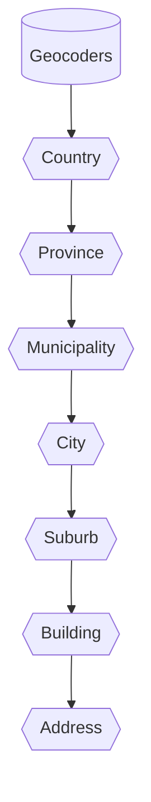

## Data
Geospatial data is at the core of Geocoders services. This data can be hard to work with, often in specialised spatial
formats that require specific domain knowledge and expensive GIS (Goespatial Information Systems) software, rarely complete
or easy to use. That is where Geocoders comes in. We have extensive experience in the Geospatial data world and
have done the heavy lifting for you.

Each country has their own unique set of challenges & complexities with regard to data. Countries have different ways
of capturing their data, not all countries have provinces, some use regions, thus making each country's data unique.
To spare you from this complexity we have designed an easy to use Unified Data Model (*UDM*).
A hierarchical relationship that allows for blazingly fast and easy to use APIs.

### Datamodel
The Geocoders datamodel currently consists of seven levels of hierarchy. Below is a diagram indicating the relationships
between each level.

* Country
* Province
* Municipality
* City
* Suburb
* Building
* Address

### Availability
The amount of available data varies per country, thus this serves as a

# Countries
* [Netherlands](/data-availability#netherlands) 🇳🇱
* [Belgium](/data-availability#belgium) 🇧🇪
* [Luxembourg](/data-availability#luxembourg) 🇱🇺

## Netherlands

## Belgium

## Luxembourg
